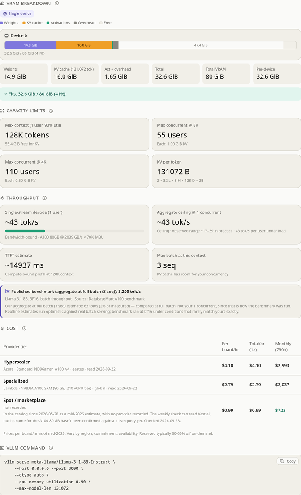

# 🧮 LLM VRAM Planner

**Stop guessing if your model fits. Know before you deploy.**

I was deploying vLLM on an air-gapped server and spent 3 hours fighting CUDA version mismatches, wrong PyTorch wheels, and OOM crashes — all because there was no tool that answered "does this model fit on my GPU, and what flags do I pass to vLLM?" in one place. So I built one.

> **[Use it now →](https://israelhen153.github.io/llm-vram-planner/)**  ·  Single HTML file  ·  Works offline  ·  No signup



---

## What it does

**Pick a model → pick a GPU → get the answer.** VRAM breakdown, deployment command, cost estimate.

There are several good VRAM calculators around. [APXML's](https://apxml.com/tools/vram-calculator) is the one most people use and covers ground this doesn't — pipeline parallel, multi-node, CPU/NVMe offload, Apple Silicon. [WireUnwired's](https://wireunwired.com/local-llm-vram-calculator/) also generates a run command, and spans llama.cpp and MLX as well as vLLM.

No single feature here is unique. The combination is what I wanted and couldn't find: **open source, one HTML file that runs offline, and opinionated about vLLM specifically** rather than covering every engine shallowly.

- **Generates the actual `vllm serve` command** — tensor parallel, quantization, KV cache dtype, expert parallel, max context length. Copy-paste and run.
- **3-tier cost comparison** — hyperscaler (AWS/GCP/Azure), specialized (Lambda/CoreWeave), and spot (Vast.ai) pricing side by side.
- **Training estimation** — full fine-tune, LoRA, QLoRA. See exactly what's eating your VRAM: weights, gradients, optimizer states, activations.
- **Executive mode** — one-click toggle. Shows verdict, cost range, and max users. Hand the URL to your manager.
- **Per-user and aggregate throughput, kept separate** — a single user's decode speed and total server throughput differ by 50–100× under continuous batching, so they're reported as two numbers with two rooflines, and benchmarks are only ever compared against the matching one.
- **Import any model** — paste a HuggingFace ID or drop a `config.json`. Works for models that aren't in any preset list.
- **Report export** — copy a Markdown summary straight from the tool, or run `generate_report.py` for a procurement-ready PDF.
- **Works offline** — single HTML file, no backend, no internet required after first load. <!-- ANALYTICS-DOC:BEGIN -->The hosted copy counts page views, and you can turn that off from the footer — see [Analytics](#analytics).<!-- ANALYTICS-DOC:END -->

---

## How accurate is it?

It's a planning tool. It gets you to the right hardware and the right flags; it does not replace benchmarking your actual workload.

**VRAM** is close to exact — weights, KV cache and optimizer state are arithmetic. Activations, CUDA context and NCCL buffers use fixed heuristics (1% of active params, 1.5 GiB/GPU, 0.2–0.3 GiB per extra GPU), so treat the total as ±10%, and don't plan to run at 99% utilisation. One deliberate exception: a mixture-of-experts model above 8 GPUs reads about 1.75× optimistic on weights — see [Above 8 GPUs](#above-8-gpus).

**Throughput** comes from a memory-bandwidth roofline at 70% MBU, capped by a compute roofline at 35% MFU. TTFT uses a separate 45% prefill MFU — dense prefill GEMMs run at higher utilisation than decode's starved ones:

```
tok/s = (batch × achieved_bandwidth) / (active_weight_bytes + batch × kv_bytes_per_seq)
```

Against the measured benchmarks in `benchmarks/data.json`, single-stream lands within ~4% — but read that number with its caveat: the only two single-stream entries in the dataset are llama.cpp measurements on an RTX 4090, not vLLM. Decode at batch 1 is bandwidth-bound in either engine, which is why the roofline tracks them, but nothing here validates vLLM's own single-stream behaviour. Aggregate throughput runs 1.1–2.3× optimistic — a roofline is an upper bound, and real serving loses time to scheduling and prefill interleaving. The UI shows both numbers: the ceiling, and the inverse of that optimism as an observed range (43–91% of ceiling). The range is re-derived from the measured entries in `benchmarks/data.json` by the test suite, so it tightens as contributed data comes in and cannot silently drift.

**Benchmark data** is 13 entries: 7 measured with a published source, 6 extrapolated or unverified. The estimated ones are flagged `"estimated": true` and the UI says so. Comparisons only ever run against a benchmark of the matching kind — a single-stream estimate is never scored against a batch measurement.

**Costs** are list prices from mid-2026 and drift constantly. Reserved and committed-use pricing typically runs 30–60% below on-demand.

### Above 8 GPUs

Every number above is measured or bounded on **one** GPU. Above eight devices the tool
splits into TP × DP, and three things get weaker. It now says so beside each affected
figure rather than only here:

- **Nothing above 2 devices is measured.** All 13 benchmark entries are single-GPU. The
  interconnect penalty — about 15% for NVLink, 45–60% for PCIe and worsening as the ring
  grows — is a heuristic of the same kind as MBU and MFU, and no measurement in this
  repository constrains it.
- **Mixture-of-experts weights read ~1.75× optimistic.** vLLM shards an MoE on two axes
  at once: attention and the dense FFN by TP, the routed experts across all TP × DP
  ranks. No single divisor describes that, so MoE keeps the larger one on purpose — the
  other error puts DeepSeek-V3 at roughly 9× too much hardware, and over-buying is not
  the safe kind of wrong. Each MoE surface states which divisor produced its figure.
- **Per-user speed and TTFT are cluster-scoped, so roughly 4× optimistic.** They pool
  every device's bandwidth for a single request, but under data parallelism that request
  is served by one replica. That is a known bug awaiting its fix, not a modelling
  choice, and it is flagged in the interface.

Per-device VRAM for dense models is correct at any device count; that error is fixed and
in the tool now, ahead of the v1.1 release it belongs to. What stays unmeasured above
8 GPUs is throughput.

Every formula, constant and known failure mode is written up in **[docs/MODEL.md](docs/MODEL.md)** — including why the two throughput numbers are different quantities, and where the estimates break down.

Run `./tests/run.sh` to check the math yourself.

### Known gaps

Things it does not model yet, listed because finding out the hard way is worse:

- **Pipeline parallel and multi-node.** TP and DP only. Single-node assumptions throughout. One surface disagrees and is simply wrong: the "Layers per device" tile divides layers by the device count, which is pipeline-parallel arithmetic on a command that never emits it. The tile says so; the fix is queued.
- **CPU/NVMe offload.** If it doesn't fit in VRAM, the answer here is "it doesn't fit".
- **Non-NVIDIA hardware and non-vLLM engines.** AMD is on the roadmap for v1.1. Apple Silicon, llama.cpp and MLX are not planned — see [ROADMAP.md](ROADMAP.md) for why.
- **Speculative decoding and MTP.** Both change the throughput picture substantially and neither is modelled.
- **Chunked prefill scheduling.** Prefill and decode interleaving affects tail latency under mixed load.

### What it does model, that most calculators don't

- **Three KV cache regimes.** Full attention, sliding-window (Gemma 3/4, Llama 4 chunked), and MLA (DeepSeek). These differ by more than 5×, and applying the wrong one is the single biggest source of error in VRAM planning.
- **Prefix caching as a memory effect, not just a latency one.** vLLM V1 enables APC by default. With a shared system prompt it stores that prefix once rather than once per request — 64 users sharing an 8K agent preamble is 63 GiB of KV back on an H100. It cuts TTFT and never touches decode speed.
- **Agentic overhead.** System prompt and tool schemas as an explicit input, because that's where the shared prefix comes from and nobody budgets for it.

---

## Quick start

### Use online
**[israelhen153.github.io/llm-vram-planner](https://israelhen153.github.io/llm-vram-planner/)**

### Use offline
Download `index.html`. Open in any browser. Done.

### Generate a PDF report
```bash
pip install reportlab
python generate_report.py --preset gemma4-26b --gpu a100-40 --prec awq --fp8-kv
```

### Share a configuration
Every slider change updates the URL. Copy it, send it to a teammate — they see exactly what you see.

---

<!-- ANALYTICS-SECTION:BEGIN -->
## Analytics

The hosted copy at [israelhen153.github.io](https://israelhen153.github.io/llm-vram-planner/) counts page views with [GoatCounter](https://www.goatcounter.com). It is there for one reason: it is how I know whether anyone actually uses this, which is what decides whether it keeps getting worked on. There is no other telemetry, no backend, and no account of any kind.

**What the page sends**, per [count.js](https://gc.zgo.at/count.js) itself: the page path (`pathname` + query string, or the canonical link's), the referrer, this page's title, your screen width, a bot flag and a cache-buster. Nothing else.

**What GoatCounter stores**, per its [privacy policy](https://www.goatcounter.com/help/privacy) (8 June 2025):

- **Stored**, as per-day and per-hour aggregate counts that cannot be linked to each other: page path, referrer, browser, OS, country, language, screen width.
- **Not stored**: IP addresses, the full User-Agent, any tracker ID. Site + IP + User-Agent is held *in memory* for up to eight hours so a repeat visit is not double-counted; it is not written to the database. The counter writes nothing to your browser — no cookies, no localStorage, no cache. Nothing is shared with third parties.
- **Your configuration is never sent.** This tool keeps its entire state in the URL fragment (`#gpu=h100-80&...`), and fragments are not part of an HTTP request. `count.js` reads `location.hash` for its own opt-out gesture and puts it in no request. The model, GPU and workload you type stay in your browser.

**To opt out**, use the **"Don't count my visits"** link in the page footer. It sets the `skipgc` flag in your browser's localStorage, which `count.js` checks before sending anything, and the same link turns counting back on. GoatCounter documents a `#toggle-goatcounter` URL for this; **it does not work on this page**, because the tool rewrites the URL fragment during startup before the counter script has loaded — which is why the control is in the footer instead.

**The one other network call** the tool can make is the HuggingFace import: if you paste a model ID, the page fetches that model's `config.json` from huggingface.co, which necessarily tells huggingface.co which model you asked about. It only happens when you use that feature, and never otherwise.

**Self-hosting or forking?** Run `./setup.sh <username>` — with no GoatCounter site code it removes the counter and every claim about it, and with one (`./setup.sh <username> <site-code>`) it points the counter at your own account. Otherwise your deployment reports its traffic to my site, which is not what either of us wants. Opened straight from `file://` it is inert either way: the script has nowhere to load from, and `count.js` refuses `file:` URLs regardless.

---

<!-- ANALYTICS-SECTION:END -->
## Who it's for

**DevOps / sysadmins** — "I have 2× A100 40GB. What can I run, and what's the vLLM command?"

**ML engineers** — "Should I LoRA or QLoRA on this hardware? How much VRAM does the optimizer eat?"

**Team leads / architects** — "Executive mode. What does this cost per month? Can I show this to procurement?"

---

## Roadmap

- **v1.0** (shipped) — NVIDIA GPUs, vLLM
- **v1.1** — AMD ROCm, and correct above 8 GPUs (that half is already done)
- **v1.2** — Repo-side price and catalog pipeline; the tool itself stays offline
- **v2.0** — UI polish, guided wizard, mobile, PWA

See [ROADMAP.md](ROADMAP.md) for details.

---

## Contributing

**The most valuable contribution is benchmark data.** If you've measured vLLM throughput on real hardware, add one entry to `benchmarks/data.json` and open a PR. See [CONTRIBUTING.md](CONTRIBUTING.md) for the format — it takes 2 minutes.

Bug reports and feature requests welcome via [Issues](https://github.com/israelhen153/llm-vram-planner/issues).

---

## Project structure

```
index.html              The tool (single file, no build step)
generate_report.py      PDF report generator
data/gpus.json          GPU catalog — the authority both engines are generated from
benchmarks/data.json    Community benchmark data
tools/sync_data.py      Bakes those two files into both engines
docs/MODEL.md           Every formula, constant and limitation, explained
docs/research/          Working notes behind catalog entries
setup.sh                Fork setup — repoints analytics at your account, or strips it
tests/run.sh            Full suite — node + python3, no other deps
tests/model.test.js     VRAM, throughput and TTFT math
tests/parity.test.py    Checks index.html and generate_report.py agree
tests/report.test.py    The PDF generator and the text it emits
tests/sync.test.py      Generated blocks round-trip and cannot be poisoned
CONTRIBUTING.md         How to add benchmarks
ROADMAP.md              Version plan
```

The model is implemented twice — once in `index.html` so the tool needs no backend, once in `generate_report.py` so the PDF needs no browser. `tests/parity.test.py` diffs the two engines field by field; if you change the math in one, change it in both or the suite fails.

---

MIT License · Built by an engineer who got tired of OOM crashes.
